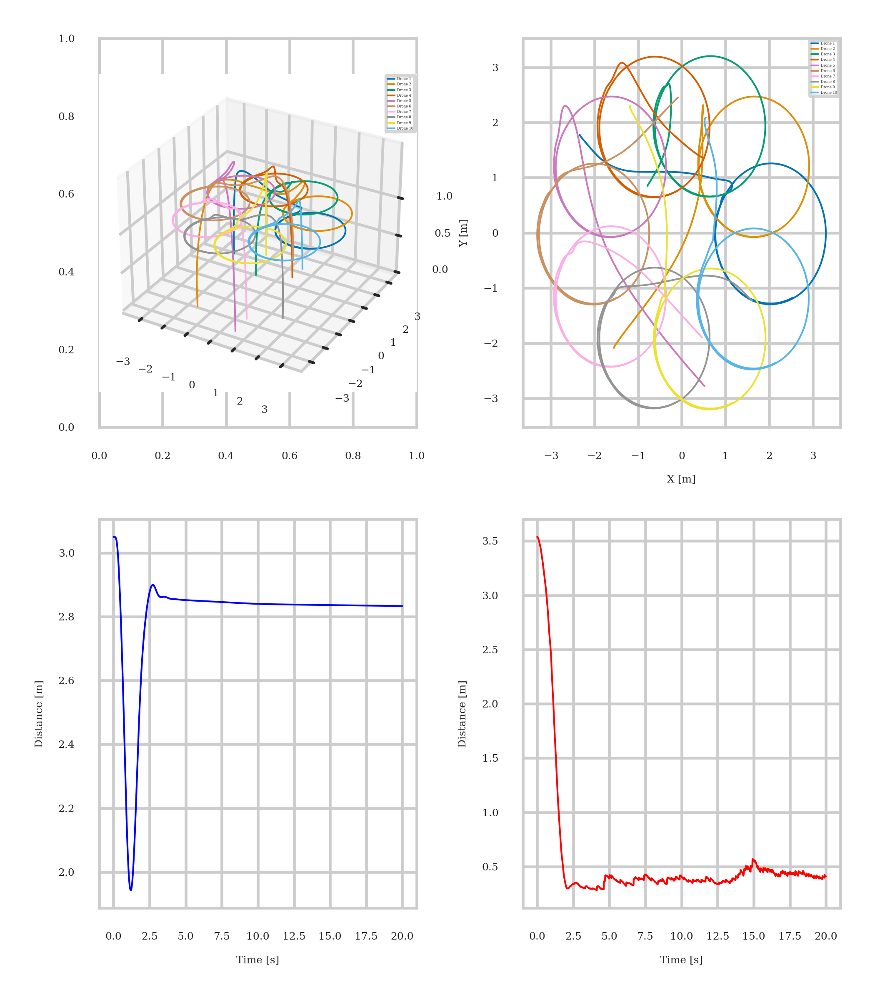
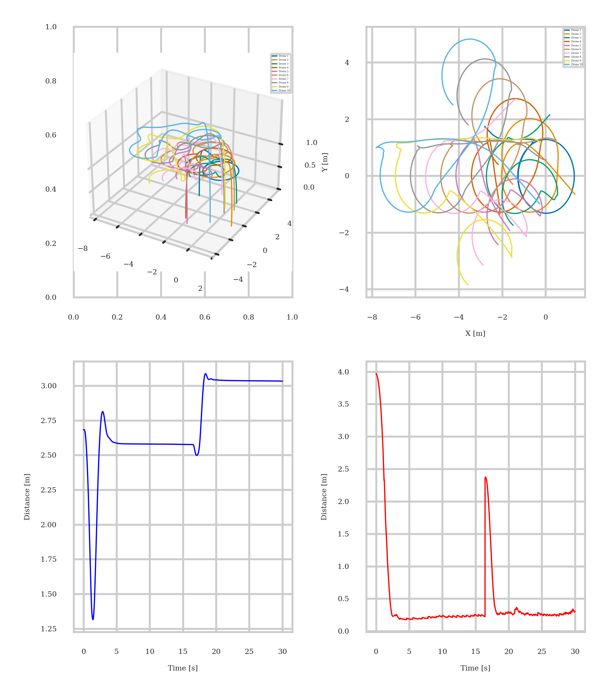
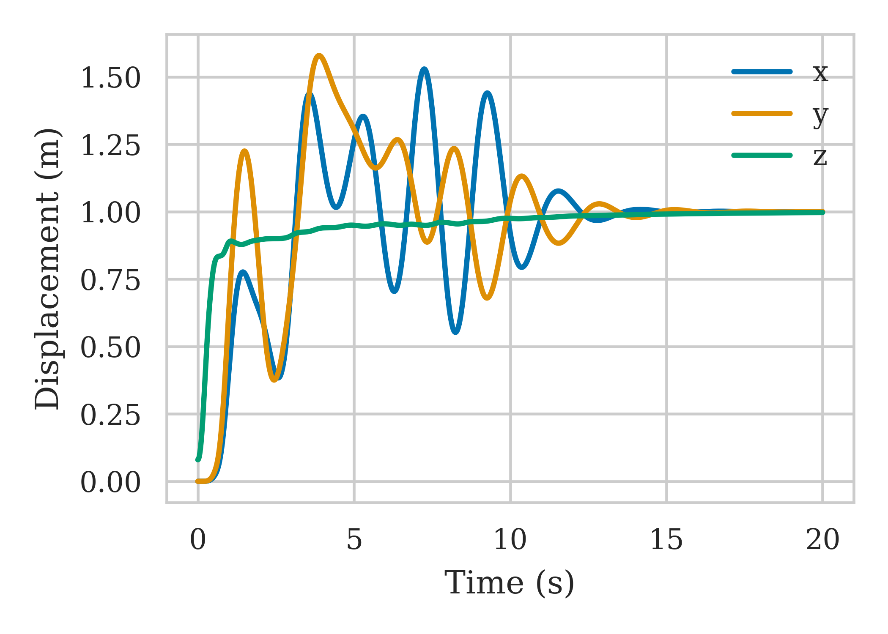
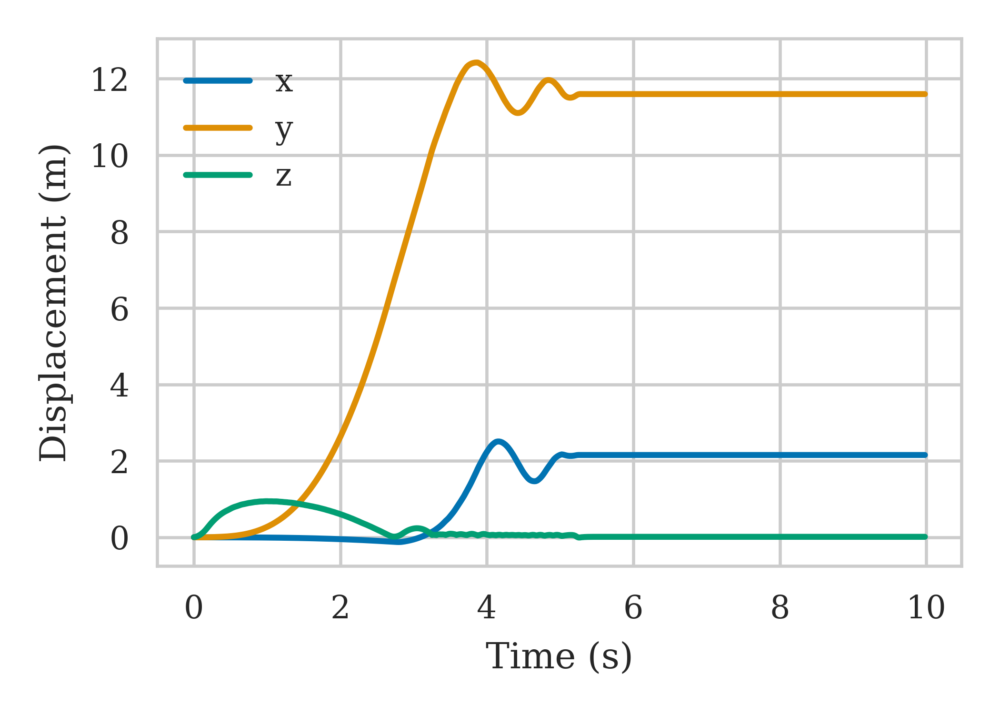
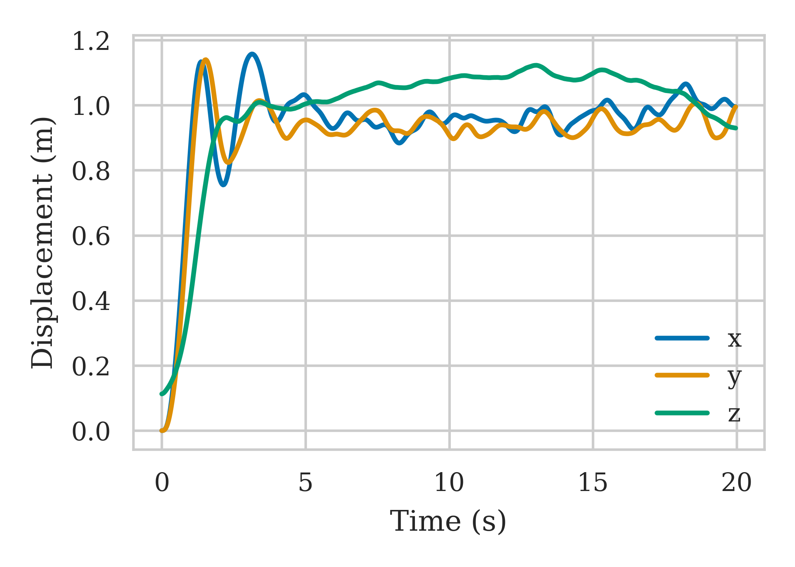
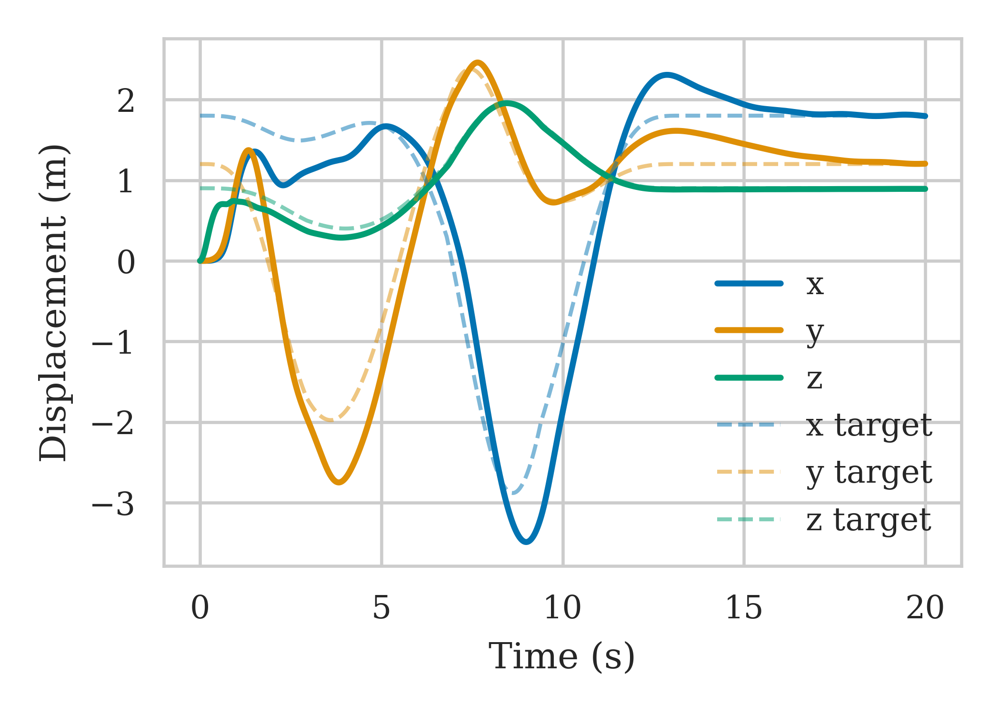
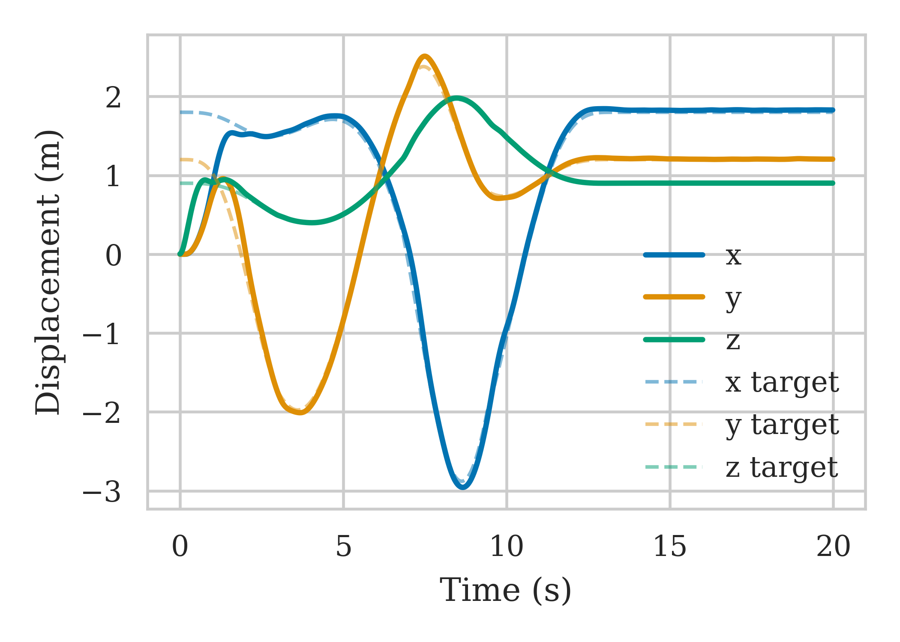

# Coordinated Quadrotor Swarm Control

This repository contains the code and resources for developing and simulating coordinated swarm operations of multiple quadrotors. The project covers dynamic modeling, controller design, trajectory planning, and formation strategies with collision avoidance in both centralized and decentralized frameworks.

## Project Overview

In this final year project, we:

- Model the quadrotor dynamics in quaternion and Euler representations.
- Implement and compare controllers: PID, LQR with integral action, MRAC, and RL (PPO).
- Design a minimum-snap trajectory planner for smooth flight paths.
- Explore multi-agent coordination via leader–follower, consensus, and behavioral strategies.
- Validate algorithms in PyBullet-based simulations.

## Features

- **Dynamics**: Quaternion- and Euler-based state-space models.
- **Controllers**:
  - PID with hierarchical loops
  - LQR with integral action
  - Model Reference Adaptive Control (MRAC)
  - Reinforcement Learning (PPO)
- **Trajectory Planner**: Minimum-snap planner supporting single and multi-segment paths.
- **Formation Control**:
  - Leader–Follower frameworks
  - Collision avoidance via potential fields
  - Decentralized consensus algorithm
  - Behavioral (separation, alignment, cohesion)
- **Simulation Environment**: `gym-pybullet-drones` integration for testing controllers and formations.

## Examples & Results

### 🌀 Formation Control

**Circular formation with 20 quadrotors using consensus algorithm**


**Line-to-V formation transition**


---

### 📍 Position Control

**PID-based position control**


**MRAC-based position control**


**LQR-based position control**


**RL-based position control**


---

### 🚀 Trajectory Tracking

**MRAC on a minimum-snap trajectory**


**PID on a minimum-snap trajectory**



## Folder Structure
```
├── LICENSE # Project license (MIT)
├── README.md # This file
├── circle_formation.png # Formation example: circular
├── line_v_formation.png # Formation example: line-to-V
├── consensus.py # Consensus-based control script
├── controllers/ # Controller implementations
│ ├── lqr.py
│ ├── pid_controller.py
│ ├── mrac.py
│ └── rl_controller.py
├── envs/ # Custom gym environments
│ ├── PositionAviary.py
│ └── SwarmAreaEnv.py
├── get_results_*.ipynb # Notebooks for result generation
├── multi_quad_control/ # Scripts for multi-quad behaviors
│ ├── behaviour.py
│ └── leader_follower.py
├── position_control/ # Position control experiments
│ ├── position_control_pid.py
│ └── position_control_rl.py
├── result_plots/ # Generated result images
├── results/ # Saved model checkpoints & evaluations
├── samples/ # Example scripts and tests
├── system_analysis.ipynb # System-level analysis and notes
├── task_solving/ # Task-solving modules
├── trajectory_tracking/ # Trajectory tracking scripts
└── utils/ # Utility functions
```

## Contributing
Contributions are welcome. Feel free to open issues or pull requests.
